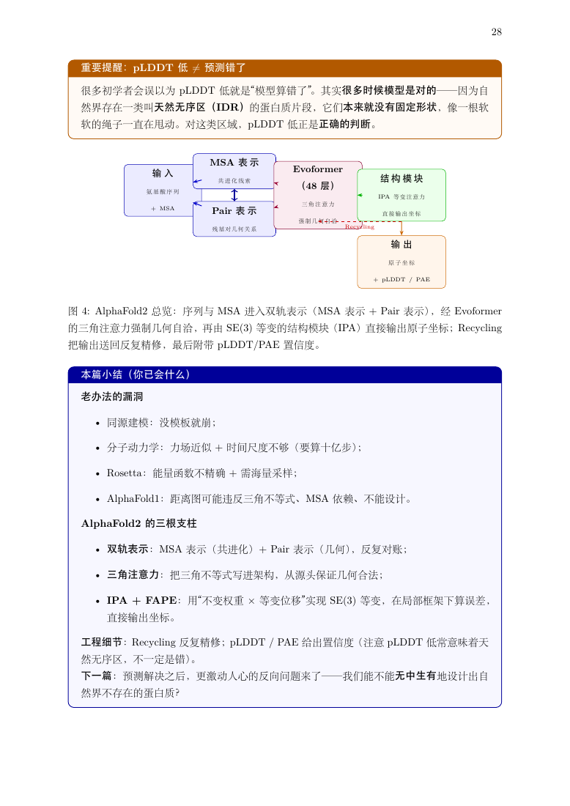

<sub><b>中文</b> · <a href="README_EN.md">English</a></sub>

<div align="center">

# 大学.skill

<p align="center">
  
  <br />
  <sub>动画由 <a href="https://github.com/alchaincyf/huashu-design">huashu-design</a> skill 制作</sub>
  <br />
  <sub>18 秒 · <a href="assets/hero.html">HTML 动画源文件</a> · <a href="assets/hero.mp4">MP4 视频</a></sub>
</p>

> *「你想上的下一堂大学课，何必等开学。」*
> *"Your next university lecture doesn't have to wait for a new semester."*

[](skills)
[](#你会得到什么)
[](README_EN.md)
[](https://github.com/walkinglabs/university-skill/stargazers)

<br />

**把一位大学教授装进你的 AI，把任何主题变成一堂真正的大学课。**

**Put a university professor in your AI. Turn any topic into a real university lecture.**

<sub>内含两个可独立安装的 Agent Skills：深度技术教材 + 40 页零基础讲义。</sub>

<br />

想学蛋白质设计、JEPA，或一个从没接触过的领域？<br />
告诉 AI 你想学什么，让它像一位好教授那样，从基础讲到原理，从例子讲到实践。<br />
需要带走慢慢读，也可以直接说：**帮我写一本 PDF 课本。**

[看效果](#效果示例) · [安装](#安装) · [两个 Skill 怎么选](#两个-skill-怎么选) · [工作原理](#工作原理)

<br />

**其他语言 / Other Languages:**

[English](README_EN.md)

<br />

</div>

---

## 效果示例

只需说出你想学的主题，以及你希望怎样学。

```text
用户       ❯ 帮我写一本 PDF 课本：从零入门蛋白质结构设计 AI4S。
             假设我只有高中生物和数学基础。

大学.skill ❯ 从氨基酸如何组成蛋白质讲起，解释序列、结构与功能的关系，
             再区分结构预测和蛋白质设计各自在解决什么问题。
             随后进入 AI 方法，用示意图、具体案例和练习逐步展开。
             最后整理为 PDF 课本，附术语表、自测答案与文献导航。
```

```text
用户       ❯ 帮我写一本 PDF 课本：从零入门 JEPA 模型。
             要讲清原理，用小数字走一遍，再给最小代码示例。

大学.skill ❯ 先解释为什么要学习表示，以及预测表示和重建像素有何区别。
             再拆开上下文编码器、目标编码器和预测器，
             用低维例子说明信息如何流动、损失如何计算，
             然后讨论表示坍塌、训练机制与不同 JEPA 变体的边界。
```

```text
用户       ❯ 帮我写一本 PDF 课本：从零理解 RSI 的发展和原理。

大学.skill ❯ 这里的 RSI 是递归自我改进，还是金融中的相对强弱指标？
             确定含义后，从它要解决的问题出发，串起发展脉络、
             核心原理、具体例子和适用边界，关键事实逐项核实来源。
```

再看一个具体的手算片段：

```text
你       › 我只有高中数学基础，给我讲透梯度下降。

大学.skill › 先从一个只有一个参数的模型开始：预测值 = w × x。
             x = 2，目标值 = 6，初始 w = 1。

             预测：1 × 2 = 2
             误差：2 − 6 = −4
             损失：½ × (−4)² = 8
             梯度：(2 − 6) × 2 = −8
             更新：1 − 0.1 × (−8) = 1.8
             新损失：½ × (3.6 − 6)² = 2.88

             为什么是减去梯度？步长太大会怎样？
             从这一个数字例子，接着推到一般公式与代码。
```

<sub>以上对话为使用示例，展示两个 skill 的预期教学方式。</sub>

---

## 成品 PDF 示例

下面两份是这套教学方法产出的真实课本，可直接下载阅读。截图展示的不是单独设计的宣传页，而是 PDF 内页。

### 从零开始懂 AI4S：蛋白质结构预测与设计

**47 页 · A4 · 面向只有高中生物和数学基础的读者**

从原子、分子、能量和蛋白质折叠问题讲起，逐步进入 AlphaFold2、扩散模型、ProteinMPNN 与 RFdiffusion。后半部分用三个点完整手算距离、旋转等变性和扩散去噪，并给出代码、名词表与自测答案。

<p align="center">
  <a href="assets/samples/pdfs/protein-structure-design-ai4s.pdf"></a>
  <a href="assets/samples/pdfs/protein-structure-design-ai4s.pdf"></a>
  <a href="assets/samples/pdfs/protein-structure-design-ai4s.pdf"></a>
</p>

<p align="center"><sub>封面与课程地图 · AlphaFold2 机制图 · 从三个点开始的完整手算</sub></p>

**[打开完整 PDF（47 页）](assets/samples/pdfs/protein-structure-design-ai4s.pdf)**

### Muon 优化器与矩阵正交化

**13 页 · A4 · 从优化器基础走到前沿算法与严格数学**

先建立损失、梯度、动量与 AdamW 的基础，再解释 Muon 为什么要把更新矩阵正交化。内容覆盖极分解、牛顿-舒尔茨迭代、收敛数值表、PyTorch 代码，以及从导数到最佳逼近定理的数学附录。

<p align="center">
  <a href="assets/samples/pdfs/muon-optimizer-masterclass.pdf"></a>
  <a href="assets/samples/pdfs/muon-optimizer-masterclass.pdf"></a>
  <a href="assets/samples/pdfs/muon-optimizer-masterclass.pdf"></a>
</p>

<p align="center"><sub>从优化器基础开始 · 矩阵正交化的几何直觉 · 数值迭代与代码实现</sub></p>

**[打开完整 PDF（13 页）](assets/samples/pdfs/muon-optimizer-masterclass.pdf)**

---

## 安装

### 方式一：一句话安装

把下面这句话交给你正在使用的技能兼容助手：

```text
帮我安装这个 skill：https://github.com/walkinglabs/university-skill
```

### 方式二：手动安装

克隆仓库后，将 `skills/` 下的两个技能目录复制到所用工具的技能目录。例如在 Codex 中：

```bash
git clone https://github.com/walkinglabs/university-skill.git
cp -R university-skill/skills/masterclass-textbook-writer ~/.codex/skills/
cp -R university-skill/skills/masterclass-40page-writer ~/.codex/skills/
```

两个入口分别是 [masterclass-textbook-writer](skills/masterclass-textbook-writer/SKILL.md) 与 [masterclass-40page-writer](skills/masterclass-40page-writer/SKILL.md)。纯讲义写作不需要额外 API Key；PDF 需要中文 LaTeX 环境，代码验证需要相应语言与依赖。

### 方式三：作为参考资料使用

如果助手不支持自动加载技能，可以直接提供 [深度技术教材 SKILL.md](skills/masterclass-textbook-writer/SKILL.md) 或 [40 页讲义 SKILL.md](skills/masterclass-40page-writer/SKILL.md)。每个技能所需的提示词和参考文件都放在自己的目录内。

---

### 使用

```text
帮我写一本 PDF 课本：从零入门蛋白质结构预测与设计 AI4S。
帮我写一本 PDF 课本：从零入门 JEPA 模型，附手算和代码。
帮我写一本 PDF 课本：从零理解递归自我改进（RSI）的发展和原理。
给我上一堂关于注意力机制的大学课，所有矩阵计算都用小数字走一遍。
把这篇论文讲给我听，先补必要前置，再推导核心方法。
```

---

## 两个 Skill 怎么选

| Skill | 什么时候用 | 核心交付 |
| --- | --- |
| [`masterclass-textbook-writer`](skills/masterclass-textbook-writer/SKILL.md) | 想从机制一路学到数学推导、代码和论文 | 25–35+ 页深度技术教材 |
| [`masterclass-40page-writer`](skills/masterclass-40page-writer/SKILL.md) | 零基础入门，希望高中生也能一路读懂 | 40 页量级通识讲义与 PDF |

两者都遵循“直觉 → 低维手算 → 严格定义 → 实现与边界”的教授式教学路径，并带齐自身需要的提示词、排版规范和参考文件。

---

## 你会得到什么

| | 深度技术教材 | 40 页通识讲义 |
| --- | --- | --- |
| 适用 | 从机制走到实现、论文与严格数学 | 从零建立完整领域地图 |
| 体量 | 约 25–35+ 页 | 约 40 页 |
| 主线 | 方法、手算、实现、边界 | 六卷递进，附录四件套 |
| 产物 | LaTeX / PDF / Markdown、代码与推导 | 分卷 LaTeX、PDF、自测与来源导航 |

<sub>页数为写作目标，以最终编译结果为准。非技术主题使用案例、史料与论证，不强行加入数学或代码。</sub>

---

## 工作原理

```text
一个主题
   │
   ├── 定起点      读者基础 / 学习目标 / 输出档位
   ├── 建地图      前置依赖 / 符号表 / 来源核实
   ├── 写深度      直觉 → 手算 → 正式定义 → 实现
   ├── 分卷装订    章节衔接 / 机制图 / 附录四件套
   └── 验证交付    数值 / 代码 / 引用 / PDF 排版
```

**讲得清楚，算得出来，查得到来源。**

类比只留给真正的难点，正文保持平静专业。新知识先铺路，严格形式放进可继续钻研的附录。学习成效根据真实作答判断，不能由助手自行宣布。

---

## 仓库结构

```text
university-skill/
├── assets/
│   ├── hero.gif                # README 开场动画
│   └── samples/                # 完整 PDF 与代表页截图
├── skills/
│   ├── masterclass-textbook-writer/
│   └── masterclass-40page-writer/
├── README.md                   # 中文介绍
└── README_EN.md                # English
```

---

## 贡献与社区

最有价值的反馈是一句：“我在这一步没跟上。”

带上主题、基础和那一段讲解，提交 [Issue](https://github.com/walkinglabs/university-skill/issues)。贡献新的手算示例、纠正推导、检验代码，或用一个新主题测试教学流程。

[提交 Issue](https://github.com/walkinglabs/university-skill/issues) · [动画源文件](assets/hero.html) · [两个 Skills](skills)

---

## 灵感与致谢

- [五道口纳什](https://github.com/wdkns/wdkns-skills)
- [女娲.skill](https://github.com/alchaincyf/nuwa-skill)：README 的叙事编排与开场动效形式。

当前为初始化版本，不代表大学认证或真实教授授课；教学效果仍需实际学习验证。

<div align="center">
<br />
<strong>把一位大学教授装进你的 AI，把任何主题变成一堂真正的大学课。</strong>
<br />
<sub>Put a university professor in your AI. Turn any topic into a real university lecture.</sub>
<br /><br />
<sub>University.skill · Built by walkinglabs</sub>
</div>
