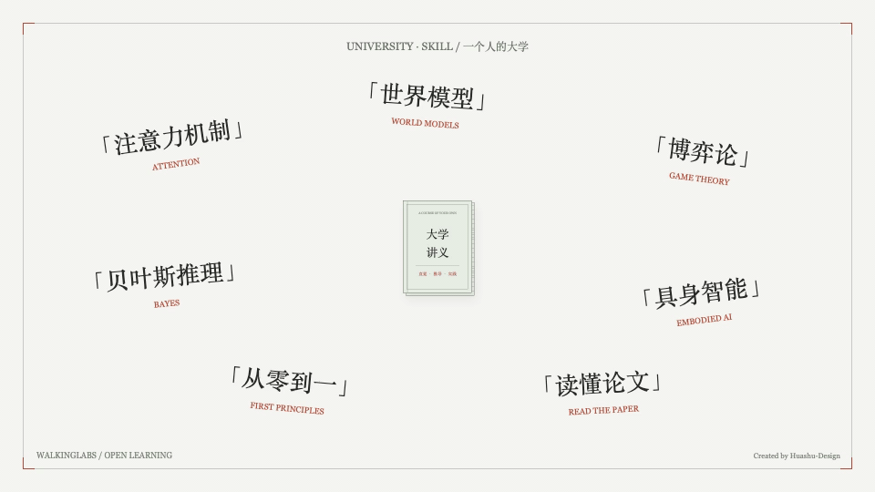
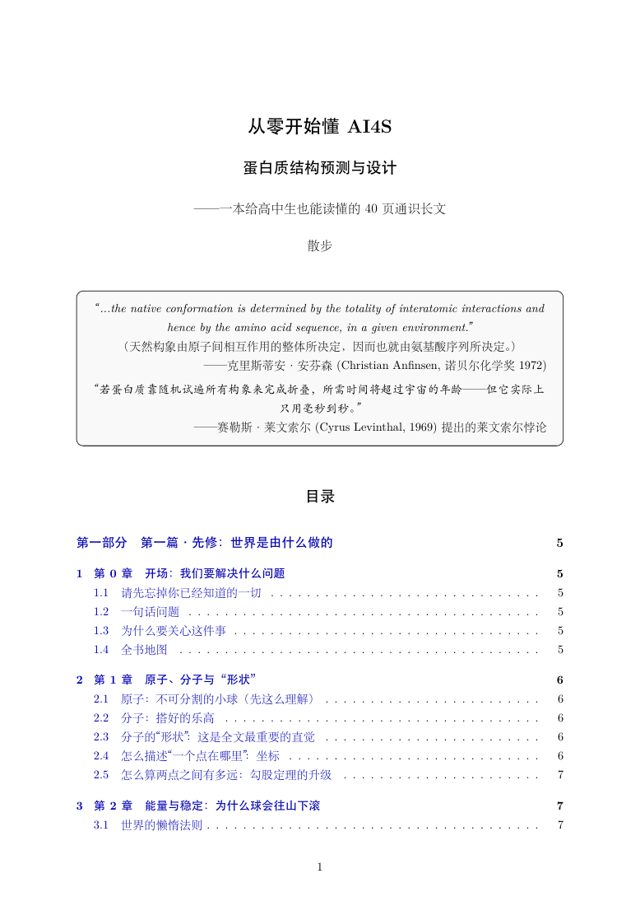
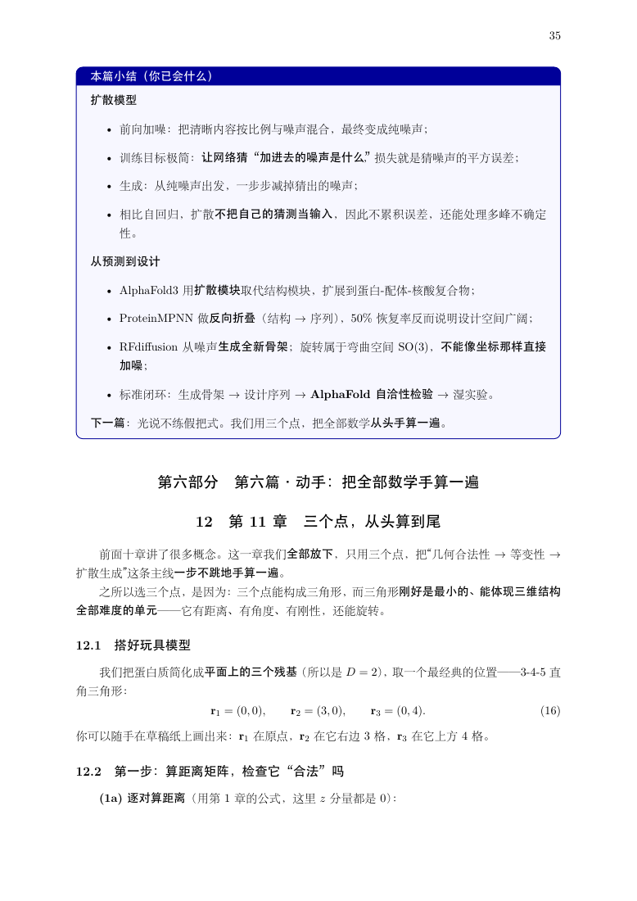
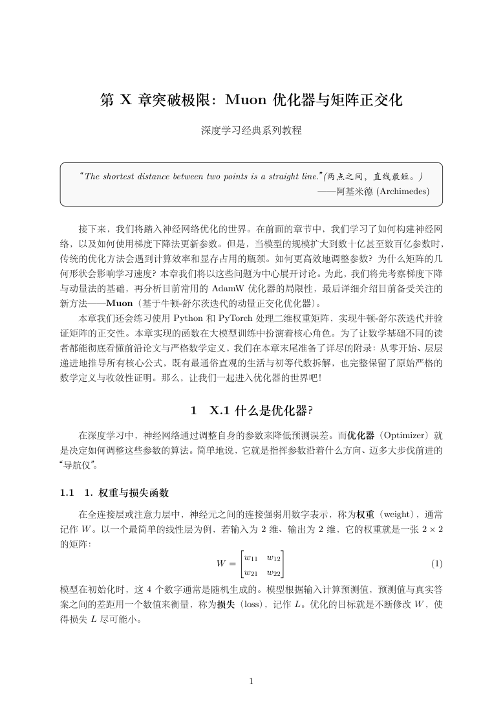
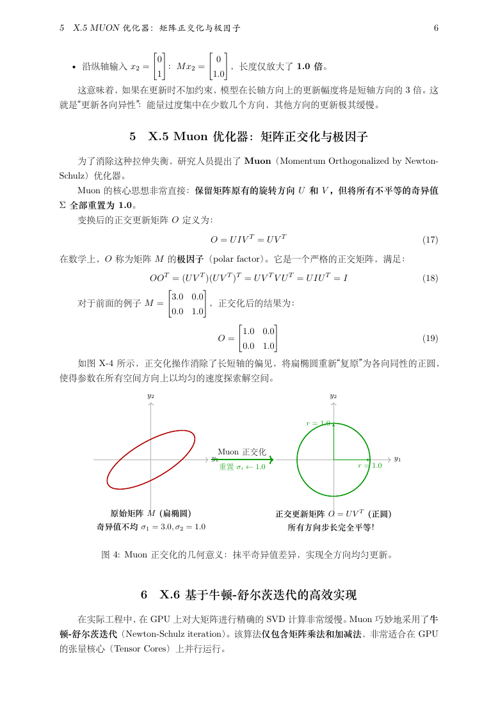
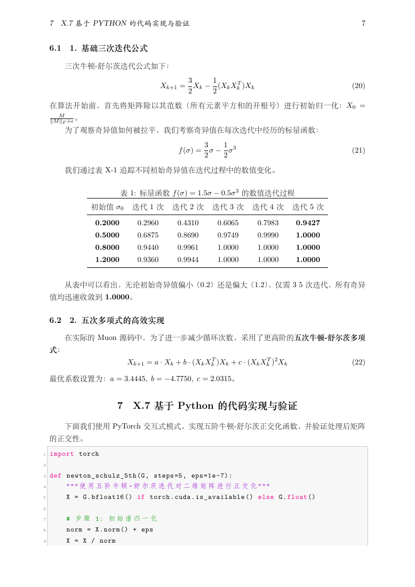

<sub><a href="README.md">中文</a> · <b>English</b></sub>

> **Issues and PDF contributions are welcome.** This project is evolving quickly, so the current version may still have bugs or compatibility issues. Please [open an issue](https://github.com/walkinglabs/university-skill/issues) with problems or suggestions. You can also share PDF coursebooks on different subjects through issues or pull requests, along with the **LLM name and version, input prompt, output quality, generation time and actual cost**. Help us discover which models deliver the best results, which cost the least and which offer the best value. Remove personal information and API keys, and share only materials you can make public.

<div align="center">

# University.skill



**Put a university professor in your AI. Turn any topic into a real university lecture.**

**把一位大学教授装进你的 AI，把任何主题变成一堂真正的大学课。**

Tell your AI what you want to learn. Let it teach from the foundations to the underlying principles and practical examples. Want a course you can keep? Ask it to write a PDF textbook.

**Two formats: a concise, approximately 20-page quick read, or a systematic coursebook of more than 40 pages.**

[中文](README.md) · [University Textbook](skills/university-textbook/SKILL.md) · [University Coursebook](skills/university-coursebook/SKILL.md)

</div>

---

## Start a Course

```text
Write me a PDF textbook: protein structure prediction and design with AI4S, from scratch.
Write me a PDF textbook: JEPA models from scratch, with worked calculations and minimal code.
Write me a PDF textbook: the development and principles of recursive self-improvement (RSI).
Teach me attention from high-school mathematics. Work through every matrix calculation.
```

Ask an Agent Skills-compatible assistant to install this repository. For manual installation, clone the repository and copy both directories under `skills/` into your runtime's skill directory. Each skill is self-contained with its own prompts and references. PDF production requires a Chinese-capable LaTeX installation; code verification requires the relevant runtime.

## What It Produces

| Bundled skill | Deliverable |
| --- | --- |
| `university-textbook` | An approximately 20-page quick read focused on core concepts, key derivations and representative worked examples |
| `university-coursebook` | A systematic coursebook of more than 40 pages, with prerequisites, step-by-step explanations, practical work, exercises and complete appendices |

Choose `university-textbook` for a focused introduction or a refresher. Choose `university-coursebook` to study a subject systematically from the foundations.

```text
Use university-textbook to write an approximately 20-page PDF explaining the core ideas of JEPA.
Use university-coursebook to write a PDF of more than 40 pages teaching protein structure prediction and design with AI4S from scratch.
```

Page counts are targets measured after compilation. Instructions are currently Chinese; the assistant should follow the learner's requested language.

The repository contains the maintainer's two complete skills rather than a third wrapper skill. Together they cover prerequisite-aware explanations, low-dimensional calculations, chapter-by-chapter writing, restrained analogies and source verification.

The project acknowledges [Wudaokou Nash · wdkns-skills](https://github.com/wdkns/wdkns-skills), a collection of Codex skills that turn YouTube and Bilibili lectures, Markdown articles and full video courses into structured LaTeX/PDF coursebooks. Its source-to-rewritten-coursebook workflow and repository organization informed this project. [nuwa-skill](https://github.com/alchaincyf/nuwa-skill) inspired the README narrative and opening presentation.

This repository includes complete sample textbooks, but does not claim measured learning outcomes or university accreditation.

## Complete PDF Samples

### Protein Structure Prediction and Design with AI4S

A 47-page, high-school-accessible textbook that progresses from atoms and protein folding to AlphaFold2, diffusion, ProteinMPNN, RFdiffusion, worked calculations, code, a glossary and self-tests.

<p align="center">
  <a href="assets/samples/pdfs/ai4s-protein-design.pdf"></a>
  <a href="assets/samples/pdfs/ai4s-protein-design.pdf"></a>
  <a href="assets/samples/pdfs/ai4s-protein-design.pdf"></a>
</p>

**[Open the complete 47-page PDF](assets/samples/pdfs/ai4s-protein-design.pdf)**

### Muon Optimizer and Matrix Orthogonalization

A 13-page masterclass from gradients and AdamW limitations through polar factors, Newton-Schulz iteration, PyTorch implementation and rigorous mathematical appendices.

<p align="center">
  <a href="assets/samples/pdfs/muon-optimizer.pdf"></a>
  <a href="assets/samples/pdfs/muon-optimizer.pdf"></a>
  <a href="assets/samples/pdfs/muon-optimizer.pdf"></a>
</p>

**[Open the complete 13-page PDF](assets/samples/pdfs/muon-optimizer.pdf)**

## Repository Layout

```text
university-skill/
├── assets/                     # Hero animation, complete PDFs and screenshots
├── skills/
│   ├── university-textbook/
│   └── university-coursebook/
├── README.md
└── README_EN.md
```
